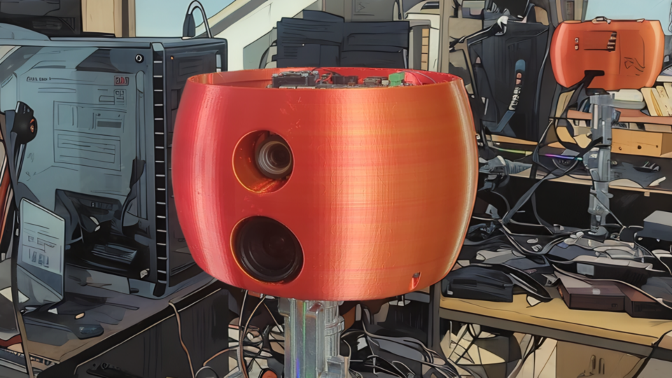

# Inverting the Looking Glass: PolieBotics for Differentiable & Cryptographic Signal-Loop Robotics and Embodied Reflection

------

### Introduction

The **PolieBotics** suite for projector–camera systems arose from the author’s independent experimentation, culminating in a “spaghetti” assembly of Dockerized third-party doctoral code running over a custom network backend. While highly instructive, it never achieved top-tier performance. More recently, large language models (such as ChatGPT) have been used to parse, explain, and re-generate portions of this ad-hoc toolkit; though not guaranteed error-free or fully equivalent to meticulously optimized components, this approach allows the public release of illustrative models and rationales.

The demonstration hardware, **PolieProboscis®**, pairs an **EKB Technologies Ltd**–manufactured **RGB DLP 4750LC** projector (1000 lumens, high-contrast/focus, on-axis) sending hardware triggers to an **Imaging Source DFK 38UX540** camera fitted with an **Edmund Optics 16 mm f/2.8 HPi+ Lens (1.2")**. Future versions will use and intertial measurement unit (IMU) which will be specified as appropriate. A draft 3D printable [model](PolieProboscis_ALPHA_NEEDS_FIX.tar.xz) is available for replication and slated for refinement.

 

### Abstract
This invention integrates projectors, cameras, and the physical environment into a continuous feedback loop guided by machine learning and cryptographic protocols. By treating the environment itself as a computational medium, it supports tamper-evident recording (**Truth Beam®**), high-density 3D scanning and labeling (**Limager®**), and immersive son-et-lumière transformations (**Reality Transform®**). These capabilities converge upon a core computational engine, the **PoliePuter®**, which paves the way for multi-agent **PolieBotics®**—a framework uniting secure data handling, privacy-preserving collaboration, and real-time physical adaptation.  

The present disclosures span different stages of development: from functioning prototypes to experimental designs that may never fully materialize. Nonetheless, they collectively illustrate how machine learning, cryptographic integrity, and environment-based computation can be harnessed to redefine interactivity, verification, and autonomy at scale.

------

### [Truth Beam](truth_beam.md) (Secure Recording) ([Example Code](https://github.com/PolieBotics/TruthBeam))

The Truth Beam embeds cryptographic elements—structured noise or one-way transforms—into emitted signals, making each recorded capture tamper-evident. Machine learning models are trained to ensure forgeries or manipulations become detectable. This effectively turns physical space into a cryptographically anchored ledger, authenticating data about real-world events. 
An example Truth Beam [dataset](https://ipfs.io/ipfs/bafybeibbapmogu2bro3ettoilge6bp5lic3u2mdohvbutgixnee463kmga) secured using the Rootstock blockchain is available on InterPlanetary File System (IPFS.)

### [Limager](limager.md) (3D Scanner and Semantic Analysis)

By projecting and analyzing textures, the Limager constructs detailed 3D representations and performs semantic labeling—detecting objects, faces, or other features. Instead of static image capture, it evolves as a real-time scene analysis tool, adapting its patterns in response to the environment and user needs.

### [Reality Transform](reality_transform.md) (Son-et-Lumière Video Mapping)

The Reality Transform superimposes dynamic, adaptive projections onto surfaces—whether people, buildings or household items—generating vibrant son-et-lumière experiences. Machine learning and sensor feedback let the system continuously refine brightness, color, and patterns, turning physical spaces into interactive storytelling platforms.

### The [PoliePuter](computation.md) (Computational Core) (Highly Experimental)

Beneath these functionalities lies the **PoliePuter**: an analog or hybrid analog–digital system hypothesized to capable of high performance in processing **convolutions, down/upsampling,** and even **fully connected layers** through environment-based optical transformations (e.g., reflections, diffraction). While it is intended to ultimately underping **PolieBotics**, e.g. in for use in [recording verification](reactor.md) it also aspires to **universal optical computation** well beyond secure video or immersive rendering. However, **unlike the other components**, the PoliePuter’s **practical viability remains unproven**, existing largely as a proof-of-concept with limited stable hardware support. Future investigation will center on improving **resonance chambers** and emitter–recorder coupling to achieve more reliable performance.

### Multi-Agent and Experimental

Will be filled out later.

------
The present work, including PolieProboscis®, is patent pending (PCT filing accepted), and all novel terms referenced herein are trademarked. Patent license will be granted for research and personal use.
The provenance of PolieBotics is discussed at https://Poliebotics.com on IPFS. This demo is produced by feeding patent text and code to ChatGPT and asking for summaries. Apologies for any errors generate in this process. The author will be working to tidy this work and produce more.
